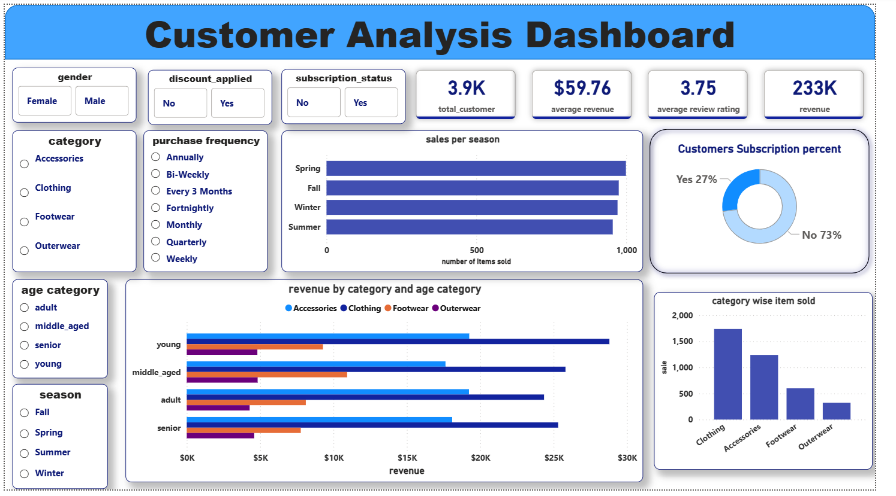

# Customer Behaviour Analysis

**Analyze customer transaction data using SQL and Python. Insights include revenue breakdowns, product performance, customer segments, and the impact of discounts and subscriptions.**

## Contents

- [pr2.ipynb](pr2.ipynb): Data cleaning, EDA, and Python analysis notebook.
- [customer_analysis.sql](customer_analysis.sql): Extensive SQL queries for business questions.
- [Customer_behaviour_dashboard.pbix](Customer_behaviour_dashboard.pbix): BI dashboard for visualizing results.

## Features

- **Data Cleaning**: Python steps to preprocess customer transaction data.
- **Exploratory Data Analysis**: Statistical and key customer metrics.
- **SQL Business Queries**:
  - Revenue by gender
  - Top-rated & top-selling products
  - Average purchase vs. shipping type
  - Impact of discounts & subscriptions
  - Customer segmentation (new, returning, loyal)
  - Top products per category by sales and ratings
  - Age-group revenue breakdown
  - Seasonal and categorical performance
  - Advanced insights with window functions and CTEs

## Power BI

- **Power BI Dashboard**: Revenue and customer insights

